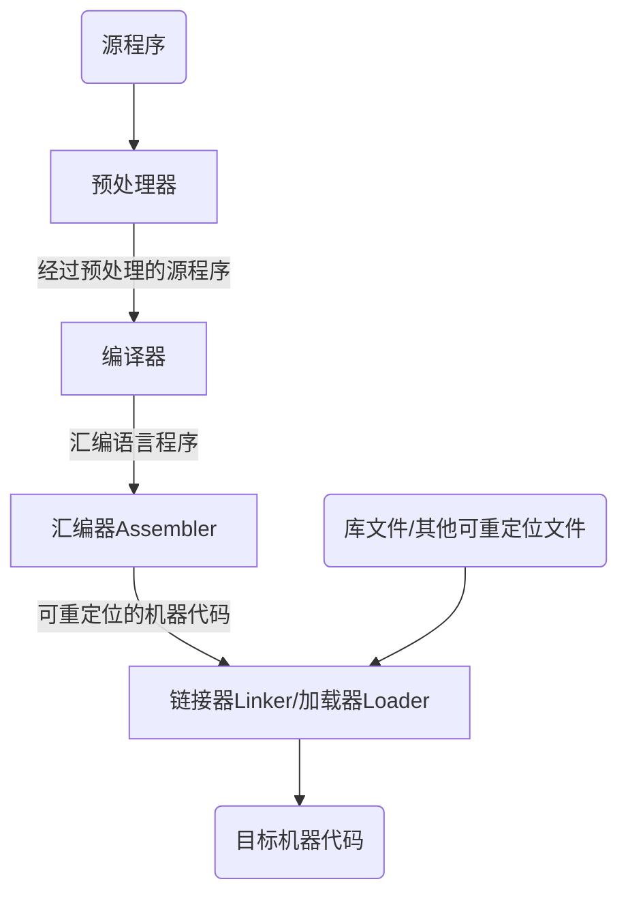
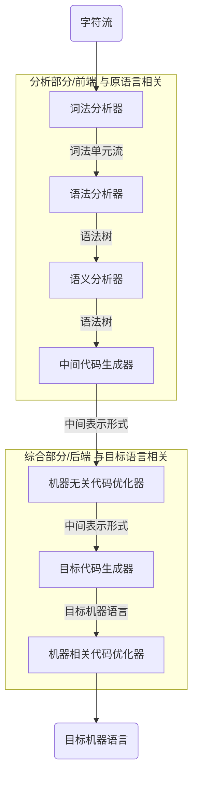

# 第一章 绪论

## 什么是编译

### 计算机程序设计语言及编译

#### 计算机程序设计语言

* ##### 机器语言

  * 计算机可以直接理解的
  * 由0和1组成
  * 难记忆，难编写，难阅读

* ##### 汇编语言

  * 引入助记符
  * 依赖特定机器，程序员要明白机器的特性
  * 编写效率低

* ##### 高级语言

  * 类似于数学定义或自然语言的简介形式
  * 接近人类的表达形式
  * 编写容易
  * 不依赖特定的机器

#### 语言的转换

* ##### 汇编

  从汇编语言转换成机器语言

* ##### 编译

  从高级语言翻译到汇编语言或机器语言

#### 编译器在语言处理系统中的位置

**可重定位（Relocatable）：**汇编后的机器代码中使用的是相对起始地址的相对地址，而在内存中起始位置L不是固定的

**加载器：**修改可重定位地址**（相对位置+起始地址=绝对地址）**，得到绝对地址，并将指令和数据放到内存中

**连接器**

* 将多个可重定位文件链接到一起
* 解决外部内存地址问题**（某个可重定位文件中使用到另一个可重定位文件的相对地址）**

## 编译系统的结构

